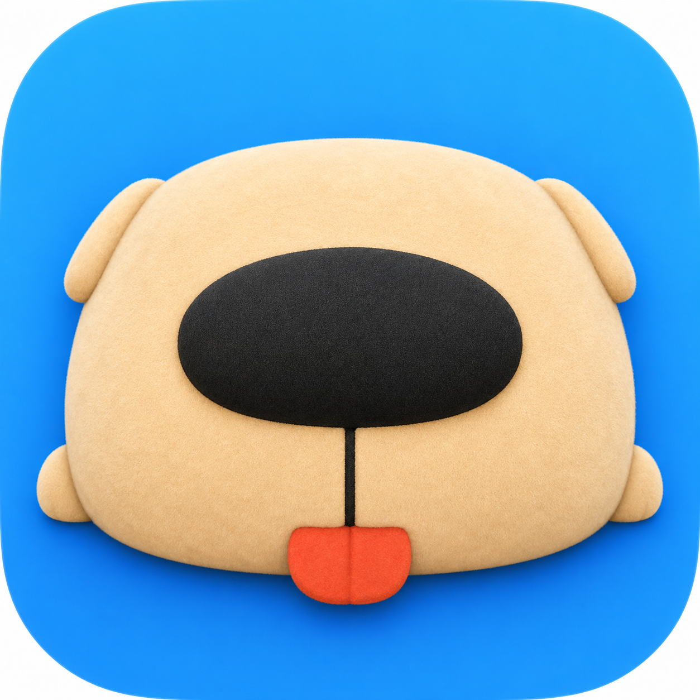
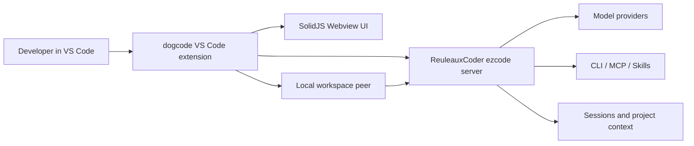

<div align="center">
  

  <h1>dogcode</h1>

  <p>
    <strong>中心化自托管 coding agent 的 VS Code 前端。</strong>
  </p>

  <p>
    像一只可靠的工作犬，从服务器把配置好的工具链、上下文和代码成果叼回本地IDE。
  </p>

  <p>
    
    
    
    
    
  </p>
</div>

## 这是什么

dogcode 是一个自用优先的 IDE 前端项目，用来连接中心化自托管的 coding agent 服务端。

它主要解决我自己面临的问题：我经常在多台电脑之间切换工作，每台机器都要重新配置自己顺手的模型、Provider、CLI、MCP、Skills、审批规则和工具链。当前 coding agent 的主流体验集中在本地运行，云端方案通常绑定指定服务商；我的实际需求是同时使用多家 coding plan、多家服务商和多种模型能力。dogcode 的目标是把这些能力集中维护在服务端，本地端只保留轻量入口、本地工作区连接和必要的交互界面。

名字里的 dog 承载这个项目的产品愿景：主 agent 像一只训练好的工作犬，能从中心化服务器出发，进入当前项目现场，把分析、修改、测试和阶段性结果带回来。后续的 subagent 会被设计成一组动物伙伴：每个伙伴负责特定场景、模型和能力，组合成可管理、可切换、可复用的 agent 团队。

当前版本仍是 MVP：核心流程已经跑通，后续会继续补齐面向泛用发布的产品能力。

## 架构关系



dogcode 负责 VS Code 侧的前端体验、配置入口、会话视图、审批交互和本地 peer 编排；真正的远程调度、Provider 管理、工具链清单、会话存储和 agent 执行由 ReuleauxCoder 服务端承担。

## 服务端依赖

本项目主要基于 [RC-CHN/ReuleauxCoder](https://github.com/RC-CHN/ReuleauxCoder) 提供的基础建设，特别感谢原作者搭建了远程 coding agent 的核心底座。

dogcode 当前实际使用的服务端需要使用我的 fork 的 `ezcode` 分支：

**[AstralSolipsism/ReuleauxCoder/tree/ezcode](https://github.com/AstralSolipsism/ReuleauxCoder/tree/ezcode)**

`ezcode` 分支提供 dogcode 前端所需的接口、会话快照和显示状态字段。上游原版服务端提供基础能力，`ezcode` 分支承载 dogcode 前端适配。

## 环境配置原理

dogcode 的配置思路是“服务端做权威源，前端做入口，当前电脑做执行现场”。

本项目出发点是纯自用，默认使用者同时承担维护者角色；权限边界按个人自托管场景设计，重点放在可信环境下的配置效率和执行可控性。

- **Host URL**：dogcode 连接的中心化 ReuleauxCoder 服务端地址。默认是 `http://127.0.0.1:8765`，真正部署到服务器后应改为服务器地址。
- **Admin Secret**：用于访问管理类 API，例如 Provider、模型 Profile、工具链清单、执行器状态等，并由 VS Code Secret Storage 保管。
- **Bootstrap Secret**：用于向服务端领取短期 bootstrap token。dogcode 会用它下载并启动适配当前系统的本地 peer，让当前 VS Code 工作区接入中心化服务端。
- **Provider 与模型 Profile**：模型服务商、API Key、主模型和副模型等配置由服务端统一管理，减少每台电脑的重复维护。
- **工具链 Manifest**：服务端维护 CLI、MCP、Skills 等能力清单。当前电脑只需要按清单检查和补齐本地环境，执行过程会经过 dogcode 的审批与自动批准规则。
- **本地 peer**：peer 运行在当前工作区，负责把服务端下发的任务落到本机项目目录里执行。这样中心化服务端能统一调度，实际文件读写和命令执行仍发生在你正在工作的机器上。

这个设计让每台电脑接入同一个 agent 控制面：模型、工具链、记忆和会话集中管理，项目现场仍保留在本地。

## 当前能力

- VS Code Activity Bar 入口与侧边栏聊天主界面
- 中心化 Host URL、Admin Secret、Bootstrap Secret 配置
- 远程会话创建、加载、保存快照与历史恢复
- Provider、模型 Profile、主/副模型目标管理
- CLI / MCP / Skills 工具链清单管理
- 当前工作区环境检查与配置流程
- 命令审批、自动批准规则与审批详情查看
- Trace Preview 原型入口，用于后续恢复更完整的 agent 过程深查

## 快速开始

推荐用容器方式部署服务端，并且从源码构建镜像。

当前采用源码构建镜像的发布方式：coding agent 的基础环境强依赖个人工作流。有人需要 Node、Python、Go、Rust，有人需要特定 CLI、MCP 服务、索引工具或系统依赖。源码构建方便你按自己的 agent 工作方式扩展 Dockerfile 或叠加运行时镜像，把容器变成自己的 agent 基础环境。

### 1. 构建并启动服务端

```bash
git clone --branch ezcode https://github.com/AstralSolipsism/ReuleauxCoder.git
cd ReuleauxCoder/docker
cp .env.example .env
```

编辑 `.env`，至少填入：

```env
RCODER_MODEL=gpt-4.1
RCODER_BASE_URL=https://api.openai.com/v1
RCODER_API_KEY=your-api-key-here
RCODER_BOOTSTRAP_ACCESS_SECRET=replace-with-a-long-random-secret
RCODER_ADMIN_ACCESS_SECRET=replace-with-a-different-long-random-secret
```

然后从源码构建并启动容器：

```bash
docker compose up -d --build
docker compose logs -f
```

默认服务会监听容器内 `0.0.0.0:8765`，并映射到宿主机 `8765` 端口。

### 2. 启动 dogcode 前端

```bash
git clone https://github.com/AstralSolipsism/dogcode.git
cd dogcode
npm install
npm run compile
```

在 VS Code 中打开本仓库后，可以按 `F5` 启动 Extension Development Host；Windows 下也可以直接运行：

```powershell
.\scripts\run-extension-host.ps1
```

### 3. 在 dogcode 中完成连接

进入 dogcode 设置页后，依次配置：

1. **Host URL**：本机容器通常是 `http://127.0.0.1:8765`，远程服务器则填写服务器地址。
2. **Admin Secret**：填写 `.env` 中的 `RCODER_ADMIN_ACCESS_SECRET`。
3. **Bootstrap Secret**：填写 `.env` 中的 `RCODER_BOOTSTRAP_ACCESS_SECRET`。
4. **Provider 与模型 Profile**：确认服务端模型配置可用，按需添加更多服务商和模型预设。
5. **工具链清单与当前环境检查**：让服务端给出权威清单，再在当前电脑上检查或配置缺失工具。

## 开发命令

| 命令 | 说明 |
| --- | --- |
| `npm run compile` | 使用 esbuild 编译扩展与 Webview |
| `npm run watch` | 监听源码变更并持续构建 |
| `npm run package` | 生产模式构建 |
| `npm run test:auto-approval` | 运行自动批准规则测试 |

## Roadmap

- [ ] 加入 subagent 管理：管理什么场景使用什么模型、什么能力，逐步打造自定义的动物伙伴 agent 团队。首批优先建设过程报告agent，打造近似antigravity的生生动报告机制，降低用户心智负荷同时也作为记忆依据
- [ ] 考虑加入更多 agent 执行器后端支持：让 dogcode 可以接入多种实现路径的 coding agent 服务端，例如 astrbot
- [ ] 加入阶段性报告机制：在长时间 coding 过程中主动汇报阶段进展，降低用户心智负荷
- [ ] 优化记忆管理机制：强化项目全局记忆与跨会话记忆能力
- [ ] 美化前端并继续优化交互体验
- [ ] 加入更多的IDE支持

## 项目状态

这是一个强自用导向的实验项目。现在的重点是先把“中心化服务端 + 多设备前端 + 本地工作区 peer”的主流程跑稳，再逐步补齐 agent 团队、记忆、报告和更完整的 UX。

## 致谢

- [RC-CHN/ReuleauxCoder](https://github.com/RC-CHN/ReuleauxCoder)：提供了本项目依赖的远程 coding agent 基础设施。
