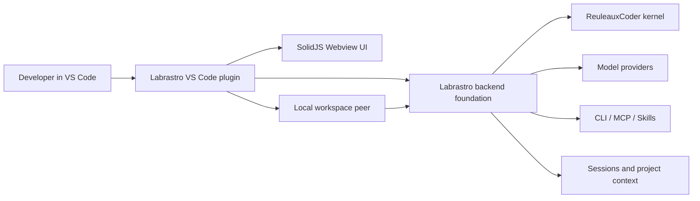

<div align="center">
  

  <h1>Labrastro VS Code</h1>

  <p>
    <strong>Labrastro 生态的 VS Code 入口。</strong>
  </p>

  <p>
    
    
    
    
    
  </p>
</div>

## 定位

`labrastro-vscode` 是 Labrastro 生态中的 VS Code 插件入口，负责本地 IDE 侧的界面、交互、审批和当前工作区 peer 编排。它不是完整后端，也不直接保存模型、Provider、工具链和 Agent Runtime 的权威配置。

Labrastro 后端基座负责远端 relay、会话持久化、Provider 管理、MCP 分发、环境清单、Agent Runtime 和任务控制面。VS Code 插件连接这个基座，把中心化配置和任务调度落到当前本地工作区。

当前工作区中，`Labrastro-vscode-extension` 是 VS Code/Webview MVP 的事实来源；ReuleauxCoder/Labrastro server 是后端控制面与执行基座。插件前端已经完成基础建设，不应被视为缺失项。

## 架构关系



保留边界：

- Python 内核包仍是 `reuleauxcoder`。
- 本地 peer artifact 仍是 `rcoder-peer`。
- CLI 仍是 `rcoder`。
- 配置目录仍是 `.rcoder`。
- Agent Runtime 中的原生执行器 id 仍是 `reuleauxcoder`。

插件自身的命名则统一使用 `labrastro.*`：命令、视图、配置、workspace state、secret key 和审批 URI scheme 都使用 Labrastro 前缀。

## 当前能力

- VS Code Activity Bar 入口与侧边栏聊天主界面。
- Labrastro Host URL、账号密码登录、refresh token 续期、账号与设备管理。
- 远程会话创建、加载、保存快照与历史恢复。
- Provider、模型 Profile、主/副模型目标管理。
- CLI / MCP / Skills 工具链清单管理。
- Agent Runtime 与 AgentRun：执行器能力展示、AgentRun 提交/事件轮询/取消/重试、fresh run 与继续同一 CLI 会话区分。
- 当前工作区环境检查与配置流程。
- 当前工作区 peer 编排、bootstrap token 获取和 `rcoder-peer` artifact 下载。
- Taskflow chat mode 基础入口；Review Cards、自然澄清流程和详情页仍是后续产品化项。
- 命令审批、自动批准规则与审批详情查看。
- Trace Preview 原型入口，用于后续恢复更完整的 agent 过程深查。

## 快速开始

### 1. 启动 Labrastro 后端

推荐用容器方式部署后端基座，并从源码构建镜像：

```bash
git clone https://github.com/AstralSolipsism/Labrastro.git
cd Labrastro/docker
cp .env.example .env
```

编辑 `.env`，至少填入：

```env
RCODER_MODEL=gpt-4.1
RCODER_BASE_URL=https://api.openai.com/v1
RCODER_API_KEY=your-api-key-here
LABRASTRO_AUTH_TOKEN_SECRET=replace-with-a-long-random-secret
LABRASTRO_SUPERADMIN_USERNAME=admin
LABRASTRO_SUPERADMIN_PASSWORD_HASH=pbkdf2_sha256$260000$replace-with-generated-hash
LABRASTRO_DATABASE_URL=
```

`LABRASTRO_SUPERADMIN_PASSWORD_HASH` 可在后端仓库中运行 `uv run rcoder auth hash-password` 生成。

然后从源码构建并启动容器：

```bash
docker compose up -d --build
docker compose logs -f labrastro-host
```

默认服务会监听容器内 `0.0.0.0:8765`，并映射到宿主机 `8765` 端口。

基础部署允许 `LABRASTRO_DATABASE_URL` 留空。此时后端进入无数据库兼容模式，适合本地、开发和单实例试用，但有这些降级：

- auth 使用 file store，依赖后端 `.rcoder` volume 保存账号和 refresh token。
- session 使用文件 store，依赖后端 `.rcoder` / session volume 保存快照。
- AgentRun、Taskflow、ProjectState、Issue、Assignment、Mention 在当前实现中重启不可恢复或能力降级。
- GitHub PR lifecycle 和 review follow-up 需要 Postgres。
- peer registry、peer token、relay pending queue 仍是单实例内存态。
- Postgres overlay 当前不等于完整 Taskflow 生产持久化；Taskflow 表存在，但 store wiring 尚未完成。

需要 Postgres 控制面时，在后端仓库使用：

```bash
docker compose -f docker-compose.yml -f docker-compose.postgres.yml up -d --build
```

启用 Postgres 后，已 wiring 的 runtime/session/auth/collaboration/GitHub 控制面状态可进入 Postgres；Taskflow 的生产级恢复仍以后续 store wiring 为准。

生产环境预期通过 Nginx、Caddy、Traefik 或 Cloudflare 等反向代理把 HTTPS Host URL 转发到容器 HTTP 端口，例如：

```text
https://labrastro.example.com -> Nginx/Caddy -> labrastro-host:8765
```

插件只需要填写对用户可访问的 Host URL。Labrastro 应用内负责账号登录、token 刷新、peer 启动和权限控制；TLS 证书、公网暴露、防火墙、IP allowlist 和反向代理日志属于部署层治理。

### 2. 启动 VS Code 插件

```bash
git clone https://github.com/AstralSolipsism/Labrastro-vscode-extension.git
cd Labrastro-vscode-extension
npm install
npm run compile
```

在 VS Code 中打开插件项目后，按 `F5` 启动 Extension Development Host。Windows 下也可以运行：

```powershell
.\scripts\run-extension-host.ps1
```

### 3. 完成连接

进入 Labrastro 设置页后，依次配置：

1. **Host URL**：本机容器通常是 `http://127.0.0.1:8765`，远程服务器填写服务器地址。
2. **用户名 / 密码**：填写后端配置的超级管理员账号和对应密码。
3. **账号与设备**：登录后可修改非配置态账号密码、撤销设备、管理用户和查看审计日志。
4. **Provider 与模型 Profile**：确认服务端模型配置可用，按需添加更多服务商和模型预设。
5. **工具链清单与当前环境检查**：让后端给出权威清单，再在当前电脑上检查或配置缺失工具。

## 开发命令

| 命令 | 说明 |
| --- | --- |
| `npm run compile` | 使用 esbuild 编译扩展与 Webview |
| `npm run typecheck` | 运行扩展与 Webview TypeScript 类型检查 |
| `npm run package` | 生产模式构建 |
| `npm run package:vsix` | 生成 `labrastro-vscode.vsix` |
| `npm run test:auto-approval` | 运行自动批准规则测试 |
| `npm run test:chat` | 运行聊天状态测试 |
| `npm run test:settings` | 运行设置页工具测试 |

## 项目状态

当前仍处于测试开发阶段，重点是跑稳“中心化后端基座 + 多设备 VS Code 入口 + 本地工作区 peer”的主流程。配置迁移和旧品牌兼容不保留。

## 致谢

- [RC-CHN/ReuleauxCoder](https://github.com/RC-CHN/ReuleauxCoder)：提供了本项目保留并继续使用的 ReuleauxCoder 内核基础。
